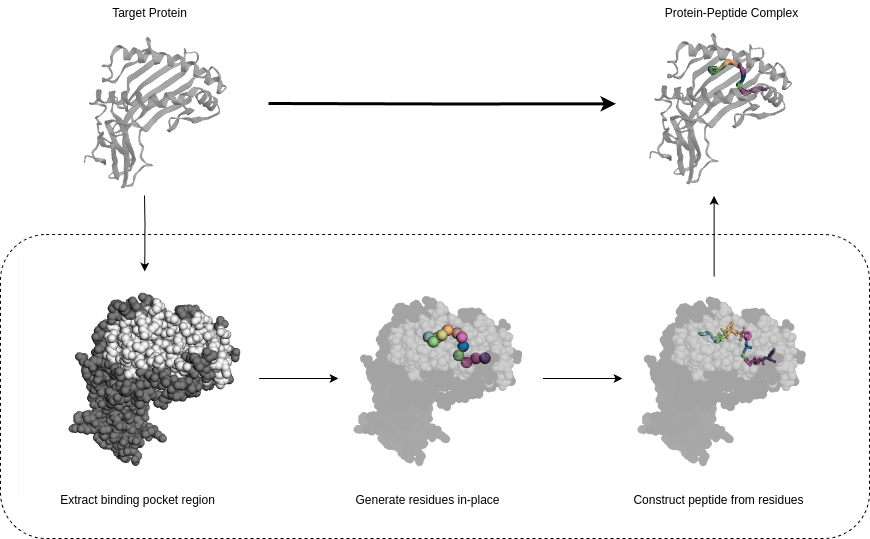

# HYDRA

This repository is the official implementation of the paper **"A Hybrid Diffusion Model for Stable, Affinity-Driven, Receptor-Aware Peptide Generation"**.

<p align="center">
  
</p>

## Requirements

HYDRA was developed using PyTorch 1.13.1 on Python 3.8.18 which remain the preferred versions to reproduce the code. A virtual environment manager such as [Conda](https://conda.io/projects/conda/en/latest/user-guide/getting-started.html) is recommended.

Install dependencies:
```setup
conda env create -f environment.yml
```

Activate the environment:
```setup
conda activate HYDRA
```

## Data

The model was trained on `release-2020-03-18` of [PepBDB](http://huanglab.phys.hust.edu.cn/pepbdb/db/download/).  
It can be obtained by running:
```
wget http://huanglab.phys.hust.edu.cn/pepbdb/db/download/pepbdb-20200318.tgz
```

Scripts to clean and preprocess the dataset for usage with HYDRA is provided in the `utils/datasets/` directory and can be used as follows:
```
python3 utils/datasets/clean_pepbdb.py --source /path/to/pepbdb --dest /path/to/pepbdb --n_atom_thr 200
python3 utils/datasets/process_pepbdb.py --source /path/to/pepbdb --dest /path/to/pepbdb_natoms200_pocket10 --radius 10
```

## Pre-trained Model Checkpoint

You can download the model weights used in the paper [here](https://drive.google.com/drive/folders/1paFyU48Rn5DHEkmc9xUrPAvtHVfcXik5) for inference.

## Configuration

Configuration management for HYDRA is done through multiple .yml files located in the `configs/` directory.  
- `train.yml` specifies the parameters for training the diffusion model along with path to the processed dataset.
- `sample.yml` specifies parameters for sampling, including the number of peptides to sample for each target receptor and model weights to load.
- `reconstruct.yml` specifies the reconstruction algorithm as well as its hyperparameters.

These configurations might have to be modified to point to the dataset and checkpoint path on your system before proceeding with training and evaluation.

## Training

To train HYDRA, run:

```train
python3 scripts/train.py configs/train.yml
```

Optionally, you may specify the parameter `--num_gpus N` in order to perform multi-GPU training using the Distributed Data Parallel strategy.  
The parameter `--ckpt` can be used to resume training from an existing checkpoint.

## Evaluation

Evaluating HYDRA must be done in two stages: 
1. Sampling residues based on the target receptor.
2. Reconstructing generated residues into peptides.

### 1.1 Sampling for all receptors in the testset

```eval
python3 scripts/sample-testset.py configs/train.yml configs/sample.yml --out_dir ./outputs
```

### 1.2 Sampling for a receptor from PDB

```eval
python3 scripts/sample-pdb.py data/pfemp1/PF3D71150400_MEDIUM.pdb configs/train.yml configs/sample.yml --out_dir ./outputs
```

### 2. Reconstructing sampled residues into peptides
```eval
python3 scripts/reconstruct.py ./outputs configs/reconstruct.yml
```

## Contributing
All source code within this repository is licensed under the MIT License, please see the [LICENSE](LICENSE) file for more details.
